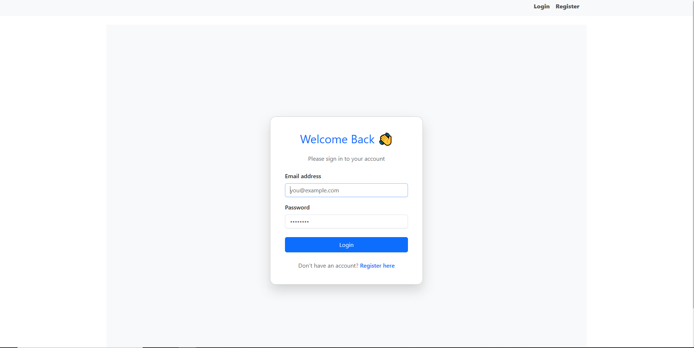
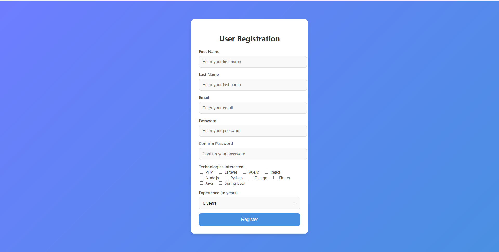
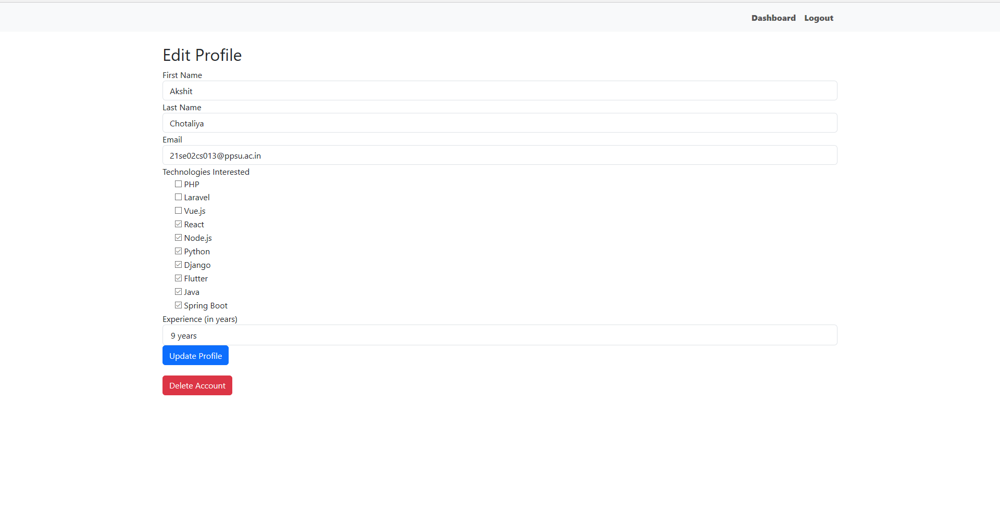
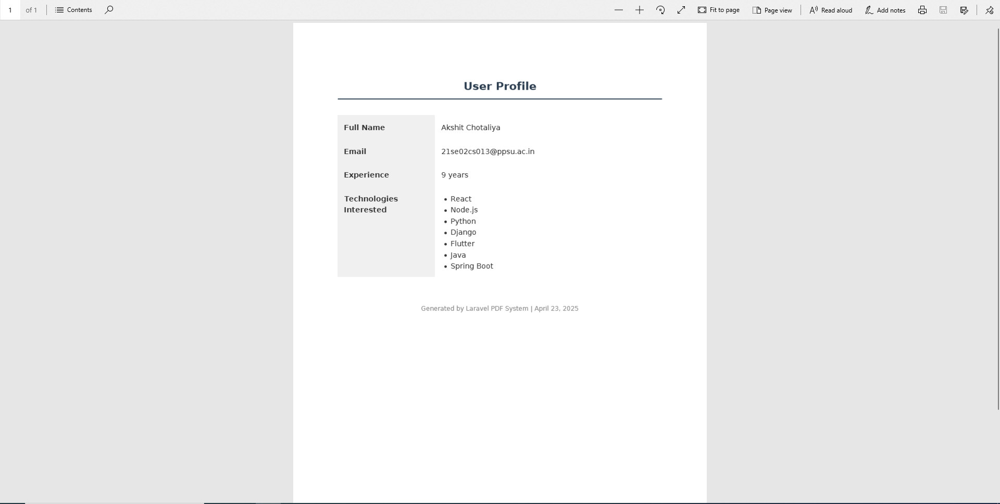
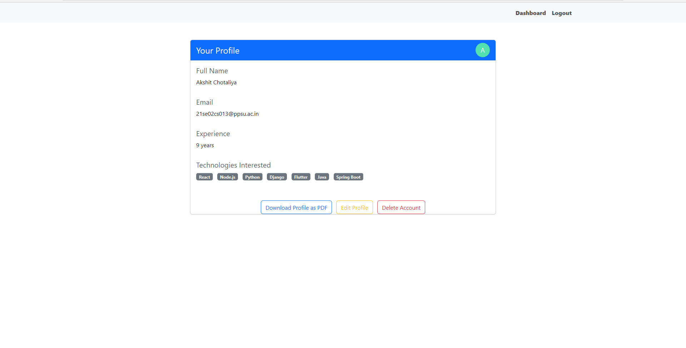

# 🧠 SkillsHub - Laravel 12 Clean Architecture

A clean and modular Laravel 12 application where users can register, manage their profiles, add skills, and generate a PDF of their information. This project follows **Clean Architecture** principles for scalability and maintainability.

---

## 🚀 Features

- 🔐 **User Registration & Login** (Laravel Breeze or custom via Passport)
- 👤 **User Profile Management** (update name, contact, address, etc.)
- 🛠️ **Skill Management** (add/edit/delete skills)
- 📄 **Generate PDF** of user details and skills
- 🎯 Built using **Clean Architecture** (Use Cases, DTOs, Services, etc.)
- 🎨 Clean UI using **Blade & Tailwind CSS**

---

## 🏗️ Tech Stack

- **Framework**: Laravel 12 (PHP 8.2)
- **Architecture**: Clean Architecture
- **Authentication**: Laravel Passport (Personal Access Tokens)
- **Database**: MySQL
- **Templating**: Blade
- **Styling**: Tailwind CSS
- **PDF Generation**: DomPDF

---

## 📸 Screenshots


### 🔐 Login Page



### 👤 User Registration Page


### ✍️ Profile and Skill Management


### 📄 PDF Download View


### 👤 Dashboard Page

---


## 🛠️  Installation

1. Clone the repository:

   ```bash
   git clone https://github.com/your-username/notekeeper-app.git
   cd skillshub
   ```

2. Install dependencies:

   ```bash
   composer install
   npm install && npm run dev
   ```

3. Copy `.env` and set up your environment:

   ```bash
   cp .env.example .env
   php artisan key:generate
   ```

4. Configure your `.env` file with your database credentials:

   ```env
   DB_DATABASE=your_db_name
   DB_USERNAME=your_username
   DB_PASSWORD=your_password
   ```

5. Run migrations:

   ```bash
   php artisan migrate
   ```

6. Install and run Laravel Passport:

  ### Step 1: Install Laravel Passport

1. **Install Laravel Passport via Composer**:

   ```bash
   composer require laravel/passport
2. **Generate the OAuth clients manually**:
   ```bash
   php artisan passport:client

   ```
7. Install DOMPDF Package:
   
   ### Step 1: Install DOMPDF Package
   
1. **Install DOMPDF Package via Composer**:

   ```bash
  composer require barryvdh/laravel-dompdf

   
8. Serve the application:

   ```bash
   php artisan serve
   ```

Visit `http://localhost:8000` to start using the  App.

## 📁 Project Structure

```
CLEAN_ARCHITECT/
├── app/
│   ├── Application/
│   │   └── Services/
│   │       └── Infrastructure/
│   │           └── Repositories/
│   │               └── UserRepository.php
│   │           ├── registerservice.txt
│   │           └── RegisterUserService.php
│   ├── Domain/
│   │   └── User.php
│   ├── Http/
│   │   ├── Controllers/
│   │   │   ├── Api/
│   │   │   │   └── AuthController.php
│   │   │   ├── Controller.php
│   │   │   ├── LoginController.php
│   │   │   ├── RegisterController.php
│   │   │   └── UserController.php
│   ├── Models/
│   │   └── User.php
│   └── Providers/
│       └── AppServiceProvider.php
├── bootstrap/
├── config/
├── database/
│   ├── factories/
│   ├── migrations/
│   └── seeders/
├── public/
├── resources/
│   ├── css/
│   ├── js/
│   └── views/
│       ├── layouts/
│       │   └── app.blade.php
│       ├── pdf/
│       │   └── user.blade.php
│       ├── profile/
│       │   ├── edit.blade.php
│       │   └── show.blade.php
│       ├── users/
│       │   ├── edit.blade.php
│       │   ├── dashboard.blade.php
│       │   ├── login.blade.php
│       │   ├── register.blade.php
│       │   ├── test.blade.php
│       │   └── text.txt
│       └── welcome.blade.php
├── routes/
├── storage/
├── tests/
├── vendor/
├── .editorconfig
├── .env
├── .env.example
├── .gitattributes
├── .gitignore
├── artisan
├── composer.json
├── composer.lock
├── package.json
├── phpunit.xml
├── README.md
└── vite.config.js


```

## 📌 Note

- Only authenticated users can manage their profiles.
- Profile is private and user-specific.


## 🤝 Contributing

Pull requests are welcome. For major changes, please open an issue first to discuss what you would like to change.

## 📄 License

This project is open-sourced under the MIT license.
